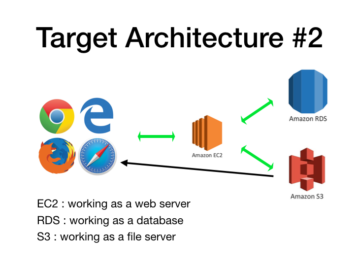

# What's new
I have updated the demo code for the AWS architecture 2 to support new technologies and simplify the setup process. The original code can be found at [https://github.com/thejungwon/AWS/](https://github.com/thejungwon/AWS/tree/master/architecture2).


> **Note**
> You must have AWS account so you can create all services required and remember to understand AWS services before using this script, create account at https://aws.amazon.com/free/ Good Luck!!


# Added supports 
- python3
- boto3
- refactored and remove unnecessary code

# AWS Services
- EC2
- RDS
- S3

# Prerequisites

- EC2-server with ports firewall allowed to be accessed.
- S3 bucket with security policies allowed to be accessed, get S3 REGION 
- RDS database created to get username, password, and database name and rds endpoint
- allow inbound traffic in RDS so RDS endpoint can be accessed
- security credentials for accessing aws services, including ACCESS_KEY AND SECRET_KEY

my s3 bucket policy configuration, modify to meet your needs

```
{
    "Version": "2012-10-17",
    "Statement": [
        {
            "Effect": "Allow",
            "Principal": "*",
            "Action": [
                "s3:PutObject",
                "s3:GetObject",
                "s3:DeleteObject"
            ],
            "Resource": "arn:aws:s3:::yourbucketname/*"
        },
        {
            "Effect": "Allow",
            "Principal": "*",
            "Action": "s3:ListBucket",
            "Resource": "arn:aws:s3:::yourbucketname"
        }
    ]
}
```

# How To Run

```
https://github.com/peterlymo/aws-lab.git
cd aws-lab
```

then 

```
bash install.sh <RDS_ENDPOINT> <ACCESS_KEY> <SECRET_KEY> <S3_REGION> <S3_BUCKET_NAME> <RDS_SD_USERNAME> <RDS_DB_PASSWORD> <RDS_DB_NAME> 
```
Example 

```
bash install.sh cp424.c8jbakfloyel.us-east-1.rds.amazonaws.com AKIAQU*********** 7xTQPLfOhoL+**************** us-east-1 cp-424-s3 admin pass**** cp424db

```

> **Warning**
> Now you are ready to go. Occasionally, things may not work as expected, but as an engineer, I trust that you have the skills to troubleshoot and resolve any issues that may arise. Remember that Google is your Friend


# Architecture


